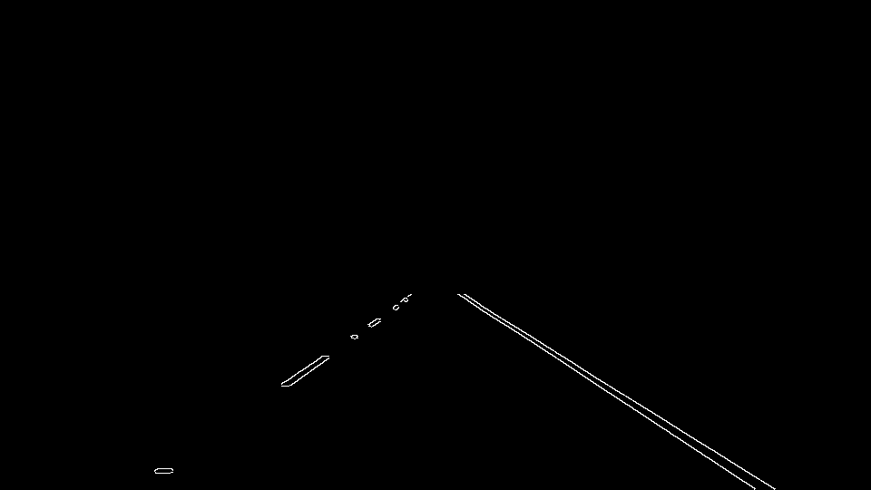

# Finding Lane Lines on the Road

The goal of the project is to create an image processing pipeline that would
identify the road lane lines in the images taken by a car frontal camera. As a
result, the pipeline should draw 2 straight lines over the lane lines found in
the image.

This is what the result would look like: 


### Pipeline description

The pipeline I implemented consists of the following steps.

The source image is converted to grayscale, and the image is slightly
smoothened using the Gaussian filter with the kernel of size 7:


Next, I apply the Canny algorithm to detect the edges of potential lane
lines, with the following thresholds: 
```python
canny_params = {'low': 120, 'high': 180}`
```


In order to remove irrelevant details from the image, I apply a region
mask that would only keep the lines in front of the car. The region I'm
interested in is a trapezoid, roughly resembling the shape of the road: 


Using the Hough transform, I detect the potential straight lines in the region
of interest. Empirically, I came up with the following parameters for the Hough
transform that work reasonably well:
```python
hough_params = {'threshold': 30, 
                'min_line_length': 20, 
				'max_line_gap': 30}
```
Using these values, the line segments are identified as follows:


As a final step, I produce a resulting image, drawing the found line segments
into the original image: 


### Average lane lines

In order to draw the lane lines as two straight lines, rather than a bunch of
line segments, I derive the parameters (slope and intercept) by averaging the
slopes and intercepts of found line segments. 

First of all, I separate the segments with the positive and negative slopes, for
right and left lane lines, respectively. Second, I decided to filter out the
segments that look too vertical or too horizontal, to reduce the
distortion. Finally, the slopes and intercepts for each lane line are calculated
by averaging those of individual segments.


### Apply the pipeline to video clips

Using the `moviepy` library, it's easy to apply the pipeline to a video
clip. Please see the video clips `lane_solidWhiteRight.mp4` and
`lane_solidYellowLeft.mp4` in the `videos/out` directory. 


###2. Identify potential shortcomings with your current pipeline


One potential shortcoming would be what would happen when ... 

Another shortcoming could be ...


###3. Suggest possible improvements to your pipeline

A possible improvement would be to ...

Another potential improvement could be to ...
